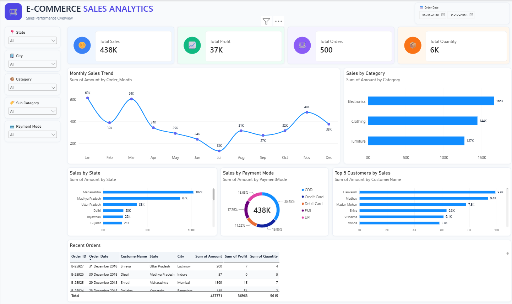

# E-Commerce Sales Analytics

An end-to-end e-commerce data analytics project using Python, SQL Server, and Power BI to analyze sales performance, profitability, customer orders, product categories, and business trends.

## Dashboard Preview

---

## Project Overview

This project analyzes an e-commerce sales dataset to understand overall sales performance and identify important business trends.

The project combines:

- Python for data analysis and exploration
- SQL Server for data storage and querying
- Power BI for interactive dashboard development

The main objective is to transform raw e-commerce data into meaningful business insights through SQL analysis and interactive Power BI visualizations.

---

## Project Functionalities

### 1. Data Analysis

The dataset was analyzed to understand:

- Sales performance
- Profit performance
- Order volume
- Product quantity
- Customer activity
- Category performance
- Sub-category performance
- Regional sales trends
- Payment mode analysis

### 2. SQL Analysis

SQL Server was used to store the e-commerce data and perform business analysis.

Key metrics include:

- Total Sales
- Total Profit
- Total Orders
- Total Quantity
- Customer analysis
- Category-wise sales
- Sub-category-wise sales
- Regional performance
- Payment mode analysis

### 3. Power BI Dashboard

An interactive Power BI dashboard was created to visualize the sales data.

The dashboard includes:

- Total Sales
- Total Profit
- Total Orders
- Total Quantity
- Sales by Category
- Sales by Sub-Category
- Sales by State
- Sales by Payment Mode
- Profit analysis
- Order details
- Interactive filters

### 4. Interactive Filtering

Users can explore the dashboard using filters and slicers to analyze different segments of the e-commerce data.

---

## Key Business Metrics

| Metric | Value |
|---|---:|
| Total Sales | 437,771 |
| Total Profit | 36,963 |
| Total Orders | 500 |
| Total Quantity | 5,615 |
| Customer Names | 336 |

> Customer Names represents the number of distinct customer names present in the dataset.

---

## Technologies Used

### Programming & Analysis
- Python
- Pandas
- Matplotlib

### Database
- Microsoft SQL Server
- SQL

### Visualization
- Microsoft Power BI

### Tools
- VS Code
- SQL Server Management Studio
- GitHub
- GitHub Desktop

---

